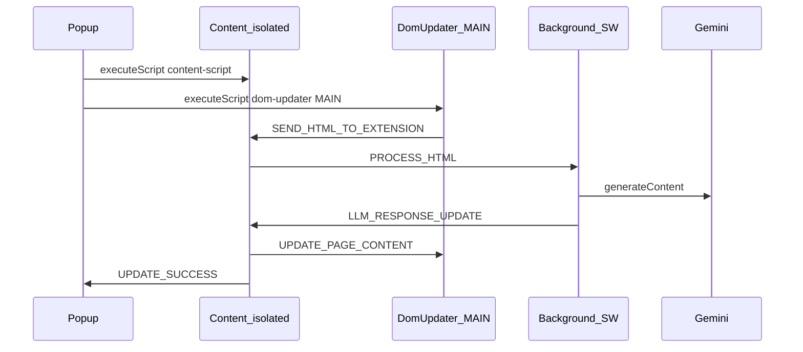

# PDP AI: LLM-generated for Merchandisers

Chrome extension (Manifest V3) that sends product page (PDP) HTML to **Google Gemini**, then applies SEO and UX suggestions on the live page via CSS selectors. The popup shows original vs suggested copy with reasons; refresh the tab to revert DOM changes.

---

## Tech stack

| Layer | Stack |
|--------|--------|
| Extension | Chrome **Manifest V3** (service worker, content scripts, popup, options) |
| UI | **Angular 19** (standalone) — `projects/popup`, `projects/options` |
| Scripts | **TypeScript** + **esbuild** (IIFE) — background, content script, MAIN-world DOM updater |
| LLM | **Gemini 2.5 Flash** — `generativelanguage.googleapis.com` v1beta `generateContent` |
| Shared code | `libs/messaging`, `libs/llm-contract`, `libs/extension-paths` |

Engineering docs: [`docs/README.md`](docs/README.md). Agent entry point: [`AGENTS.md`](AGENTS.md).

---

## Repository layout

```
├── extension/manifest.template.json   # Source manifest (assembled into dist/)
├── projects/
│   ├── background/                    # Service worker — Gemini + HTML prep
│   ├── content-script/                # Isolated world message bridge
│   ├── dom-updater/                   # MAIN world — capture HTML, apply selectors
│   ├── popup/                         # Analyze UI (Angular)
│   └── options/                       # API key settings (Angular)
├── libs/                              # Message types, LLM JSON contract, paths
├── scripts/
│   ├── build-scripts.mjs              # esbuild: background, content, dom-updater
│   └── assemble-extension.mjs         # Merge builds → dist/pdp-ai/
└── dist/pdp-ai/                       # Load unpacked here (generated, gitignored)
```

---

## Architecture

Three execution contexts talk via **`chrome.runtime` messages** and **`window.postMessage`** (see [`docs/features/message-passing.md`](docs/features/message-passing.md)).



| Part | Role |
|------|------|
| **Popup** | Starts analyze, shows loading / results / errors |
| **Content script** | Forwards HTML to background; forwards LLM payload to MAIN + popup |
| **Background** | Trims HTML, calls Gemini (API key from storage only here) |
| **DOM updater** | Runs in the page MAIN world — no `chrome.*`; updates DOM by selectors |

**Security:** API key in `chrome.storage.local` (`geminiApiKey`); never injected into the page. Trimmed HTML is sent to Google when the user clicks **Analyze Page**.

---

## Prerequisites

- **Node.js** 18+ (LTS recommended)
- **npm** (comes with Node)
- Chromium-based browser with extension Developer mode

---

## Setup

1. Clone the repository and install dependencies:

   ```bash
   npm install
   ```

2. Build the extension artifact:

   ```bash
   npm run build:extension
   ```

3. Open `chrome://extensions`, enable **Developer mode**, click **Load unpacked**, and select **`dist/pdp-ai`** (not the repo root).

4. Get a Gemini API key from [Google AI Studio](https://aistudio.google.com/app/apikey).

5. Open the extension **Options** page, paste the key, and click **Save Key**.

---

## npm scripts

| Script | Description |
|--------|-------------|
| `npm run build:extension` | Full build: esbuild scripts + Angular popup/options + assemble `dist/pdp-ai/` |
| `npm run build:scripts` | Only background, content-script, and dom-updater bundles |
| `npm run build:popup` | Angular production build for the toolbar popup |
| `npm run build:options` | Angular production build for the options page |
| `npm start` | Alias for `build:extension:watch` (see below) |
| `npm run build:extension:watch` | Runs one full build; re-run after edits (no file watcher yet) |

After any source change: **`npm run build:extension`** → reload the extension on `chrome://extensions` → **refresh the PDP tab** before analyzing again.

---

## Usage

1. Open a product detail page (PDP).
2. Click the extension icon → **Analyze Page**.
3. Wait for loading to finish; review SEO (head) and UX (body) suggestions in the popup.
4. Changes are applied on the page automatically; **refresh the tab** to restore the merchant’s original content.

---

## Development notes

- **Ship target:** always load **`dist/pdp-ai`** in Chrome.
- **Manifest / version:** edit [`extension/manifest.template.json`](extension/manifest.template.json), then rebuild.
- **Angular + MV3 CSP:** production builds disable critical CSS inlining so extension pages do not use inline `onload` handlers (see `angular.json` and `scripts/assemble-extension.mjs`).
- **Release zip:** build, then zip the `dist/pdp-ai` folder — see [`docs/playbooks/release-extension.md`](docs/playbooks/release-extension.md).

---

## Validation & testing

Manual test matrix: [`docs/TESTING-GUIDE.md`](docs/TESTING-GUIDE.md). No automated test suite in the repo today.

---

## Demos


---

## Future improvements

- i18n for global users
- Undo applied changes without refresh
- Suggestion history
- User-controlled prompt customization
- Feedback on suggestion quality
- Image alt-text optimization
- More PDP fields (bullets, specs, reviews)

---

## PDR

See [`PDR.md`](PDR.md) for the original product/design review (some paths refer to the pre-Angular layout; use this README and [`docs/ARCHITECTURE-GUIDELINES.md`](docs/ARCHITECTURE-GUIDELINES.md) for the current structure).
